# Introdução

Informações básicas do projeto.

* **Projeto:** Lotação em transporte público
* **Repositório GitHub:** https://github.com/ICEI-PUC-Minas-PPLCC-TI/ti-1-ppl-cc-m-2024-2-g10-lotacao-em-transporte-publico.git
* **Membros da equipe:**

  * [Pedro Henrique C. Quinellato](https://github.com/PedroQuinellato)
  * [Guilherme Leão Rabelo](https://github.com/gleaor)

A documentação do projeto é estruturada da seguinte forma:

1. Introdução
2. Contexto
3. Product Discovery
4. Product Design
5. Metodologia
6. Solução
7. Referências Bibliográficas

✅ [Documentação de Design Thinking (MIRO)](https://github.com/ICEI-PUC-Minas-PPLCC-TI/ti-1-ppl-cc-m-2024-2-g10-lotacao-em-transporte-publico/blob/master/docs%2Ffiles%2FPPLCC-M%20-%20G10%20-%20Lota%C3%A7%C3%A3o%20no%20transporte%20p%C3%BAblico.pdf)

# Contexto

**A lotação é um dos problemas mais frequêntes quando o assunto é transportes públicos e isso faz parte de uma série de fatores como a falta de investimentos na infraestrutura e no trânsito nas grandes cidades, em uma nova Pesquisa CNT de Mobilidade da População Urbana, lançada nesta quarta-feira (7) com o apoio da Associação Nacional das Empresas de Transportes Urbanos (NTU), A pesquisa ouviu 3.117 pessoas presencialmente em seus domicílios, em 319 municípios com mais de 100 mil habitantes, Segundo os números da pesquisa, o ônibus permanece essencial, sendo a única opção de locomoção para 53% dos usuários. A população de baixa renda, identificada como classes C e D/E, é a que mais utiliza ônibus (79%), trem urbano/metropolitano (77%) e metrô (62%). No entanto, os usuários apontam a necessidade de melhorar o serviço. Entre os principais problemas citados estão conforto, segurança, preço da tarifa e idade dos ônibus.**

## Problema

**O problema são as causas da lotação, uma nova pesquisa divulgada pelo Moovit, aplicativo de rotas para pedestres, perguntou a passageiros de transporte público o que os faria se sentir mais seguros nos modais. 83% pediram o aumento da frota para evitar veículos lotados, mas sabemos que aumentar a quantidades dos transportes só complicaria ainda mais os problemas de tráfico, para 59%, a informação sobre a localização dos ônibus em tempo real seria útil para evitar a aglomeração em pontos e paradas, essa abordagem é util para ter um controle maior do gerenciamento de tempo e viajem nos transportes públicos.**

## Objetivos

**O nosso objetivo é, pelo meio de nossa solução, proporciar às pessoas que dependem de transporte público rotas alternativas que possam ser mais baratas e rápidas. Através disso, temos como objetivo também diminuir a lotação em ônibus e metrôs, utilizando da nossa tecnologia para conectar usuários com rotas mais eficientes e assim dispersando os mesmos de rotas muito utilizadas.**

## Justificativa

**Um dos principais motivos para o desenvolvimento das ideias do nosso projeto é a necessidade de ter algum método que ajude contra a lotação dos transportes públicos e alternativas de transportes que sejam mais rápidas e baratas de forma que os transportes públicos como ônibus/metro não sejam as unicas opções viáveis no dia a dia**

## Público-Alvo

**A princípio o nosso público-alvo seria as pessoas que diariamente usam os transportes públicos como ônibus/metro que estejam na margem de 20 até 30 anos**

# Product Discovery

## Etapa de Entendimento
>\
> **.png)**
> 
> **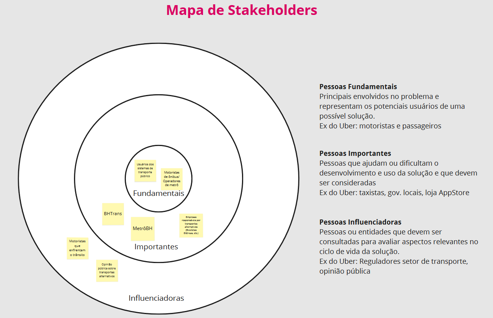**
> 
> **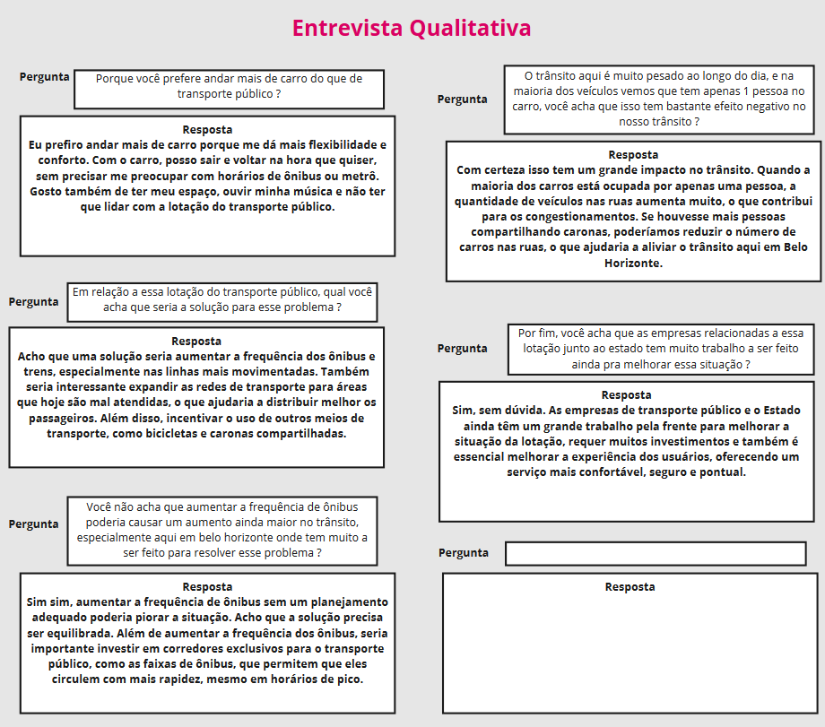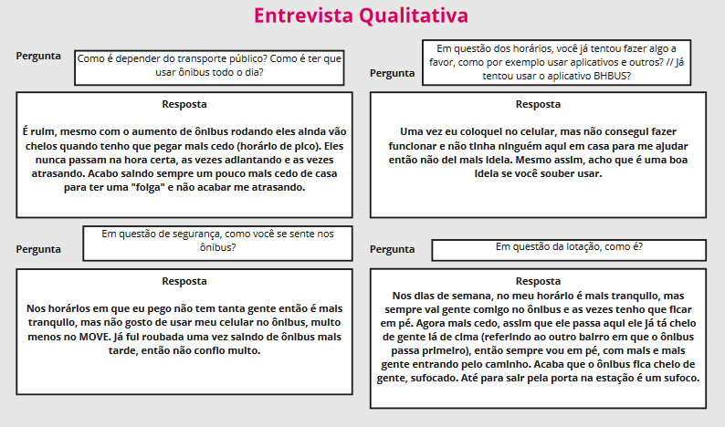**
> 
> **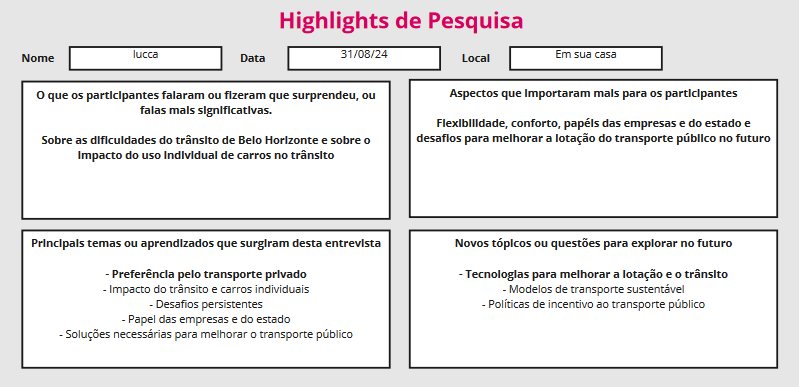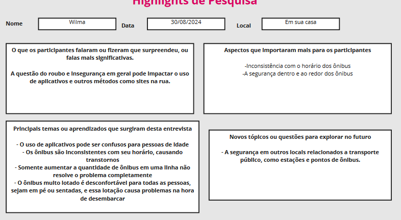**
> 
## Etapa de Definição

### Personas

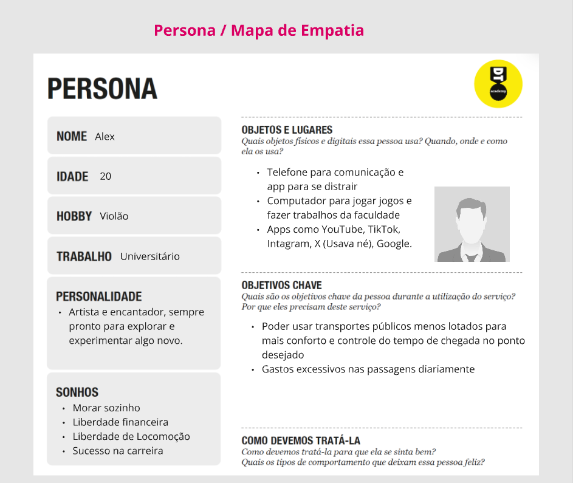

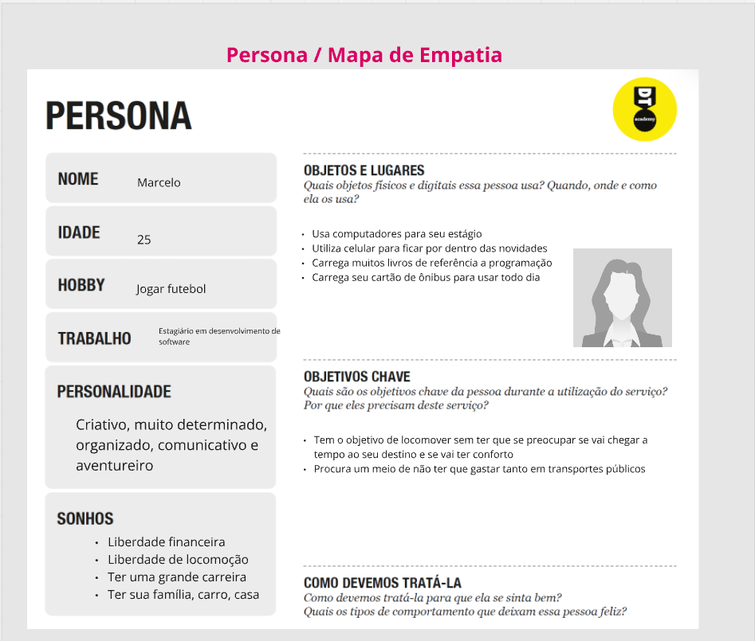

# Product Design

Nesse momento, vamos transformar os insights e validações obtidos em soluções tangíveis e utilizáveis. Essa fase envolve a definição de uma proposta de valor, detalhando a prioridade de cada ideia e a consequente criação de wireframes, mockups e protótipos de alta fidelidade, que detalham a interface e a experiência do usuário.

## Histórias de Usuários

Com base na análise das personas foram identificadas as seguintes histórias de usuários:

| EU COMO...`PERSONA` | QUERO/PRECISO ...`FUNCIONALIDADE`        | PARA ...`MOTIVO/VALOR`               |
| --------------------- | ------------------------------------------ | -------------------------------------- |
| Usuário do transporte público   | Rotas de ônibus alternativas | Não ficar desconfortável num ônibus lotado            |
| Usuário do transporte público        | Rotas mais baratas      | Poder economizar na minha rotina diária |
| Usuário do transporte público | Certeza sobre o horário em que os ônibus passam | Poder evitar imprevistos e atrasos |

## Proposta de Valor

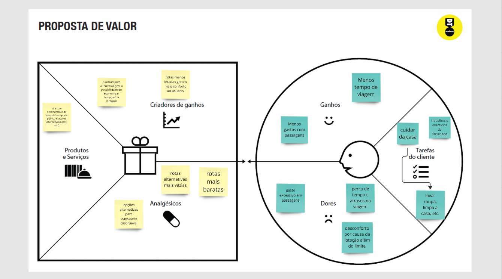

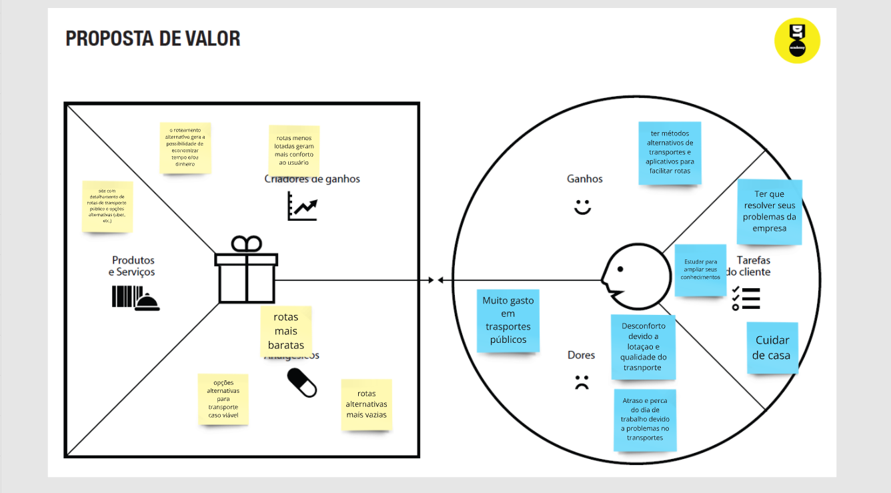

## Requisitos

As tabelas que se seguem apresentam os requisitos funcionais e não funcionais que detalham o escopo do projeto.

### Requisitos Funcionais

| ID     | Descrição do Requisito                                   | Prioridade |
| ------ | ---------------------------------------------------------- | ---------- |
| RF-001 | Permitir que o usuário cadastre tarefas ⚠️ EXEMPLO ⚠️ | ALTA       |
| RF-002 | Emitir um relatório de tarefas no mês ⚠️ EXEMPLO ⚠️ | MÉDIA     |

### Requisitos não Funcionais

| ID      | Descrição do Requisito                                                              | Prioridade |
| ------- | ------------------------------------------------------------------------------------- | ---------- |
| RNF-001 | O sistema deve ser responsivo para rodar em um dispositivos móvel ⚠️ EXEMPLO ⚠️ | MÉDIA     |
| RNF-002 | Deve processar requisições do usuário em no máximo 3s ⚠️ EXEMPLO ⚠️          | BAIXA      |

> ⚠️ **APAGUE ESSA PARTE ANTES DE ENTREGAR SEU TRABALHO**
>
> Os requisitos de um projeto são classificados em dois grupos:
>
> - [Requisitos Funcionais (RF)](https://pt.wikipedia.org/wiki/Requisito_funcional):
>   correspondem a uma funcionalidade que deve estar presente na plataforma (ex: cadastro de usuário).
> - [Requisitos Não Funcionais (RNF)](https://pt.wikipedia.org/wiki/Requisito_n%C3%A3o_funcional):
>   correspondem a uma característica técnica, seja de usabilidade, desempenho, confiabilidade, segurança ou outro (ex: suporte a dispositivos iOS e Android).
>
> Lembre-se que cada requisito deve corresponder à uma e somente uma característica alvo da sua solução. Além disso, certifique-se de que todos os aspectos capturados nas Histórias de Usuário foram cobertos.
>
> **Orientações**:
>
> - [O que são Requisitos Funcionais e Requisitos Não Funcionais?](https://codificar.com.br/requisitos-funcionais-nao-funcionais/)
> - [O que são requisitos funcionais e requisitos não funcionais?](https://analisederequisitos.com.br/requisitos-funcionais-e-requisitos-nao-funcionais-o-que-sao/)

## Projeto de Interface

Artefatos relacionados com a interface e a interacão do usuário na proposta de solução.

### Wireframes

##### Página de navegação

Um menu de navegação com opções de interação com perfil do usuário, histórico de viagens, opçôes de partida e destino, informações sobre o projeto e mapa da região.

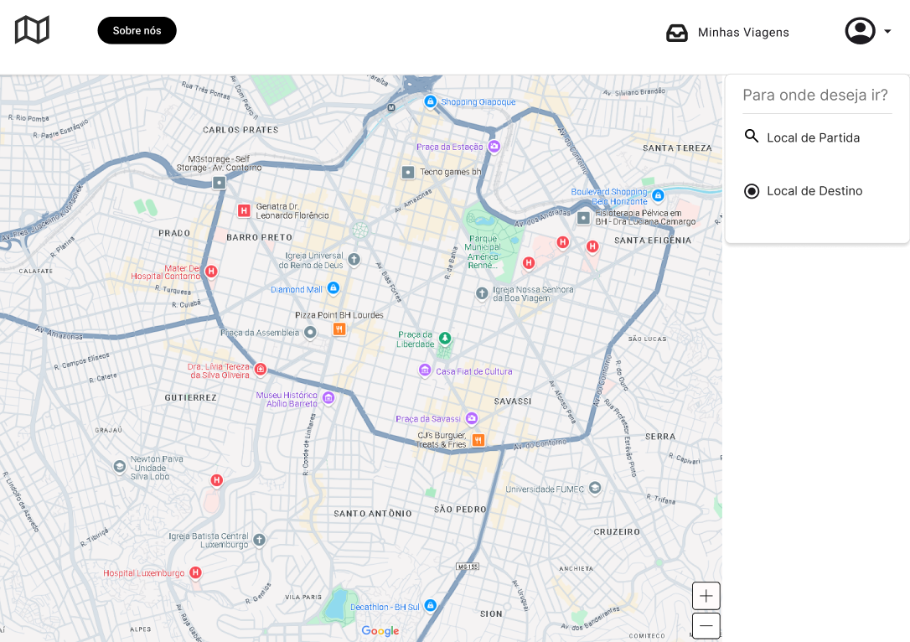

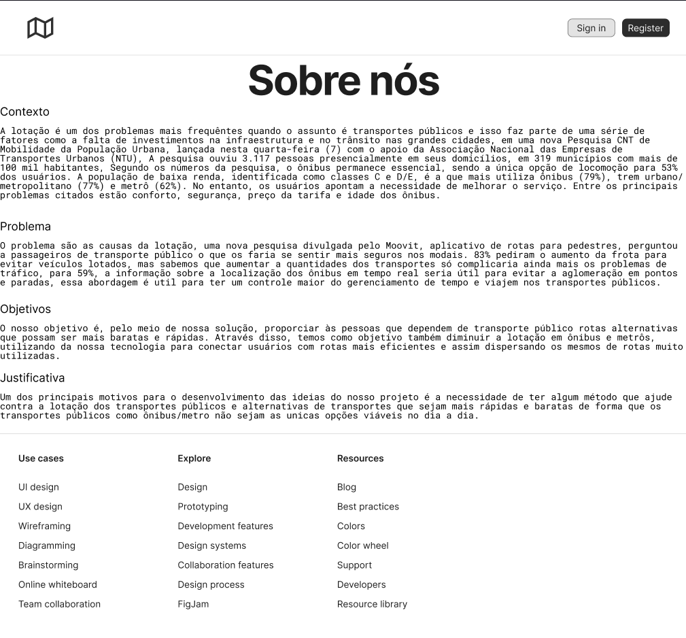

### User Flow

.png)

### Protótipo Interativo

✅ [Protótipo Interativo (MarvelApp)](https://marvelapp.com/prototype/8j8gj03)

# Metodologia

Detalhes sobre a organização do grupo e o ferramental empregado.

## Ferramentas

Relação de ferramentas empregadas pelo grupo durante o projeto.

| Ambiente                    | Plataforma | Link de acesso                                     |
| --------------------------- | ---------- | -------------------------------------------------- |
| Processo de Design Thinking | Miro       |  https://github.com/ICEI-PUC-Minas-PPLCC-TI/ti-1-ppl-cc-m-2024-2-g10-lotacao-em-transporte-publico/blob/master/docs%2Ffiles%2FPPLCC-M%20-%20G10%20-%20Lota%C3%A7%C3%A3o%20no%20transporte%20p%C3%BAblico.pdf        |
| Repositório de código     | GitHub     |   https://github.com/ICEI-PUC-Minas-PPLCC-TI/ti-1-ppl-cc-m-2024-2-g10-lotacao-em-transporte-publico.git    |
| Hospedagem do site          | Render     | https://site.render.com/XXXXXXX ⚠️ EXEMPLO ⚠️ |
| Protótipo Interativo       | MarvelApp  | https://marvelapp.com/prototype/8j8gj03   |

## Gerenciamento do Projeto

Divisão de papéis no grupo e apresentação da estrutura da ferramenta de controle de tarefas (Kanban).


> ⚠️ **APAGUE ESSA PARTE ANTES DE ENTREGAR SEU TRABALHO**
>
> Nesta parte do documento, você deve apresentar  o processo de trabalho baseado nas metodologias ágeis, a divisão de papéis e tarefas, as ferramentas empregadas e como foi realizada a gestão de configuração do projeto via GitHub.
>
> Coloque detalhes sobre o processo de Design Thinking e a implementação do Framework Scrum seguido pelo grupo. O grupo poderá fazer uso de ferramentas on-line para acompanhar o andamento do projeto, a execução das tarefas e o status de desenvolvimento da solução.
>
> **Orientações**:
>
> - [Sobre Projects - GitHub Docs](https://docs.github.com/pt/issues/planning-and-tracking-with-projects/learning-about-projects/about-projects)
> - [Gestão de projetos com GitHub | balta.io](https://balta.io/blog/gestao-de-projetos-com-github)
> - [(460) GitHub Projects - YouTube](https://www.youtube.com/playlist?list=PLiO7XHcmTsldZR93nkTFmmWbCEVF_8F5H)
> - [11 Passos Essenciais para Implantar Scrum no seu Projeto](https://mindmaster.com.br/scrum-11-passos/)
> - [Scrum em 9 minutos](https://www.youtube.com/watch?v=XfvQWnRgxG0)

# Solução Implementada

Esta seção apresenta todos os detalhes da solução criada no projeto.

## Vídeo do Projeto

O vídeo a seguir traz uma apresentação do problema que a equipe está tratando e a proposta de solução. ⚠️ EXEMPLO ⚠️

[](https://www.youtube.com/embed/70gGoFyGeqQ)

> ⚠️ **APAGUE ESSA PARTE ANTES DE ENTREGAR SEU TRABALHO**
>
> O video de apresentação é voltado para que o público externo possa conhecer a solução. O formato é livre, sendo importante que seja apresentado o problema e a solução numa linguagem descomplicada e direta.
>
> Inclua um link para o vídeo do projeto.

## Funcionalidades

Esta seção apresenta as funcionalidades da solução.Info

##### Funcionalidade 1 - Cadastro de Contatos ⚠️ EXEMPLO ⚠️

Permite a inclusão, leitura, alteração e exclusão de contatos para o sistema

* **Estrutura de dados:** [Contatos](#ti_ed_contatos)
* **Instruções de acesso:**
  * Abra o site e efetue o login
  * Acesse o menu principal e escolha a opção Cadastros
  * Em seguida, escolha a opção Contatos
* **Tela da funcionalidade**:


> ⚠️ **APAGUE ESSA PARTE ANTES DE ENTREGAR SEU TRABALHO**
>
> Apresente cada uma das funcionalidades que a aplicação fornece tanto para os usuários quanto aos administradores da solução.
>
> Inclua, para cada funcionalidade, itens como: (1) titulos e descrição da funcionalidade; (2) Estrutura de dados associada; (3) o detalhe sobre as instruções de acesso e uso.

## Estruturas de Dados

Descrição das estruturas de dados utilizadas na solução com exemplos no formato JSON.Info

##### Estrutura de Dados - Contatos   ⚠️ EXEMPLO ⚠️

Contatos da aplicação

```json
  {
    "id": 1,
    "nome": "Leanne Graham",
    "cidade": "Belo Horizonte",
    "categoria": "amigos",
    "email": "Sincere@april.biz",
    "telefone": "1-770-736-8031",
    "website": "hildegard.org"
  }
  
```

##### Estrutura de Dados - Usuários  ⚠️ EXEMPLO ⚠️

Registro dos usuários do sistema utilizados para login e para o perfil do sistema

```json
  {
    id: "eed55b91-45be-4f2c-81bc-7686135503f9",
    email: "admin@abc.com",
    id: "eed55b91-45be-4f2c-81bc-7686135503f9",
    login: "admin",
    nome: "Administrador do Sistema",
    senha: "123"
  }
```

> ⚠️ **APAGUE ESSA PARTE ANTES DE ENTREGAR SEU TRABALHO**
>
> Apresente as estruturas de dados utilizadas na solução tanto para dados utilizados na essência da aplicação quanto outras estruturas que foram criadas para algum tipo de configuração
>
> Nomeie a estrutura, coloque uma descrição sucinta e apresente um exemplo em formato JSON.
>
> **Orientações:**
>
> * [JSON Introduction](https://www.w3schools.com/js/js_json_intro.asp)
> * [Trabalhando com JSON - Aprendendo desenvolvimento web | MDN](https://developer.mozilla.org/pt-BR/docs/Learn/JavaScript/Objects/JSON)

## Módulos e APIs

Esta seção apresenta os módulos e APIs utilizados na solução

**Images**:

* Unsplash - [https://unsplash.com/](https://unsplash.com/) ⚠️ EXEMPLO ⚠️

**Fonts:**

* Icons Font Face - [https://fontawesome.com/](https://fontawesome.com/) ⚠️ EXEMPLO ⚠️

**Scripts:**

* jQuery - [http://www.jquery.com/](http://www.jquery.com/) ⚠️ EXEMPLO ⚠️
* Bootstrap 4 - [http://getbootstrap.com/](http://getbootstrap.com/) ⚠️ EXEMPLO ⚠️

> ⚠️ **APAGUE ESSA PARTE ANTES DE ENTREGAR SEU TRABALHO**
>
> Apresente os módulos e APIs utilizados no desenvolvimento da solução. Inclua itens como: (1) Frameworks, bibliotecas, módulos, etc. utilizados no desenvolvimento da solução; (2) APIs utilizadas para acesso a dados, serviços, etc.

# Referências

As referências utilizadas no trabalho foram:

https://automotivebusiness.com.br/pt/posts/mobility-now/83-dos-passageiros-querem-mais-veiculos-no-transporte-para-evitar-lotacao/

https://www.jota.info/jotinhas/mobilidade-urbana-transporte-publico-segue-indispensavel-aponta-pesquisa-cnt

https://noticias.r7.com/minas-gerais/cidade-a-cidade-transporte-publico-continua-sendo-avaliado-como-principal-problema-de-bh-22112023/
