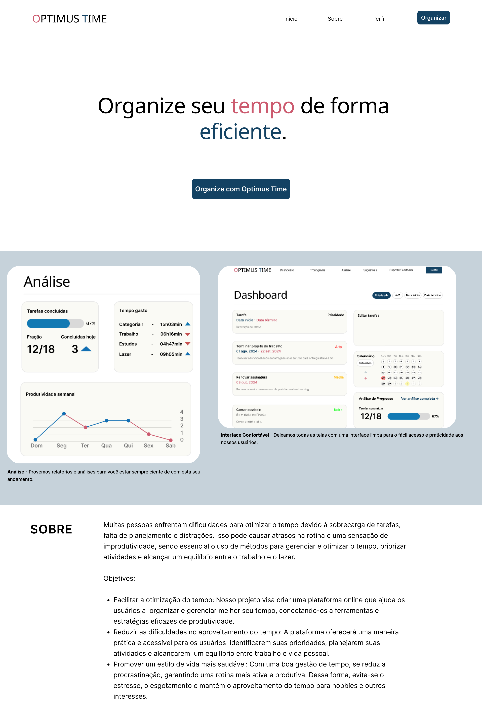
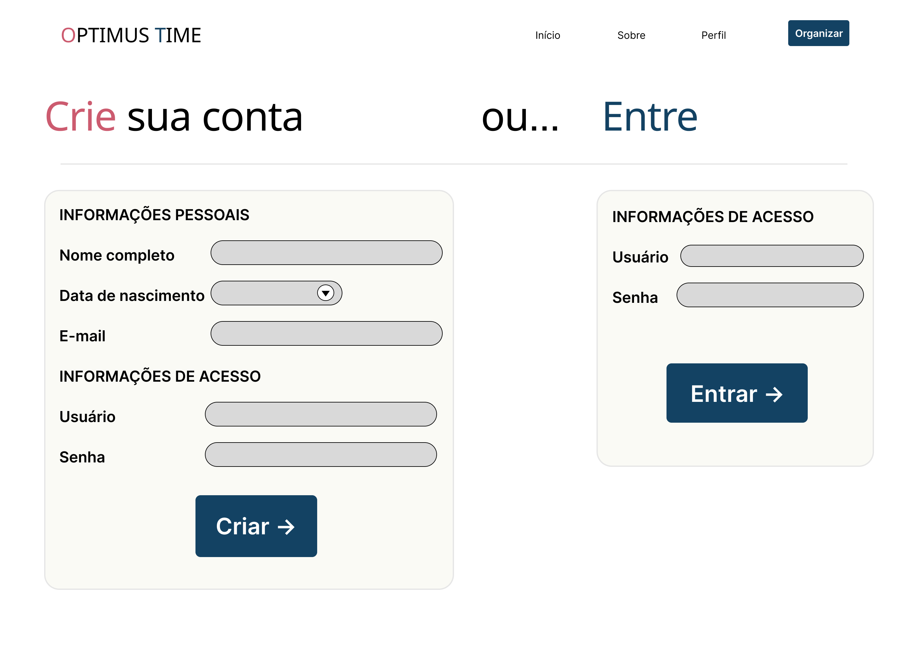
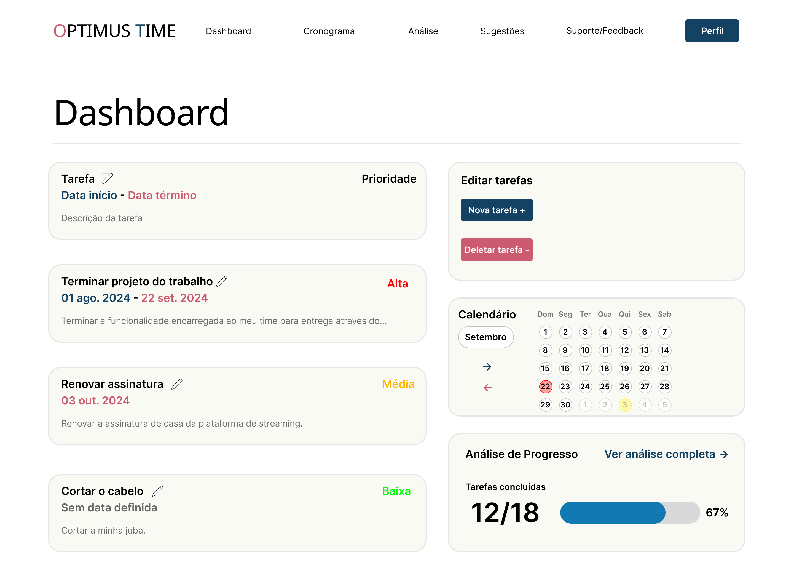
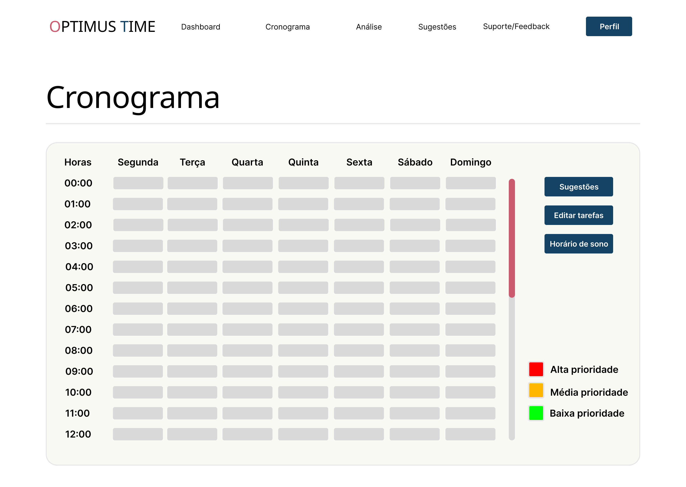
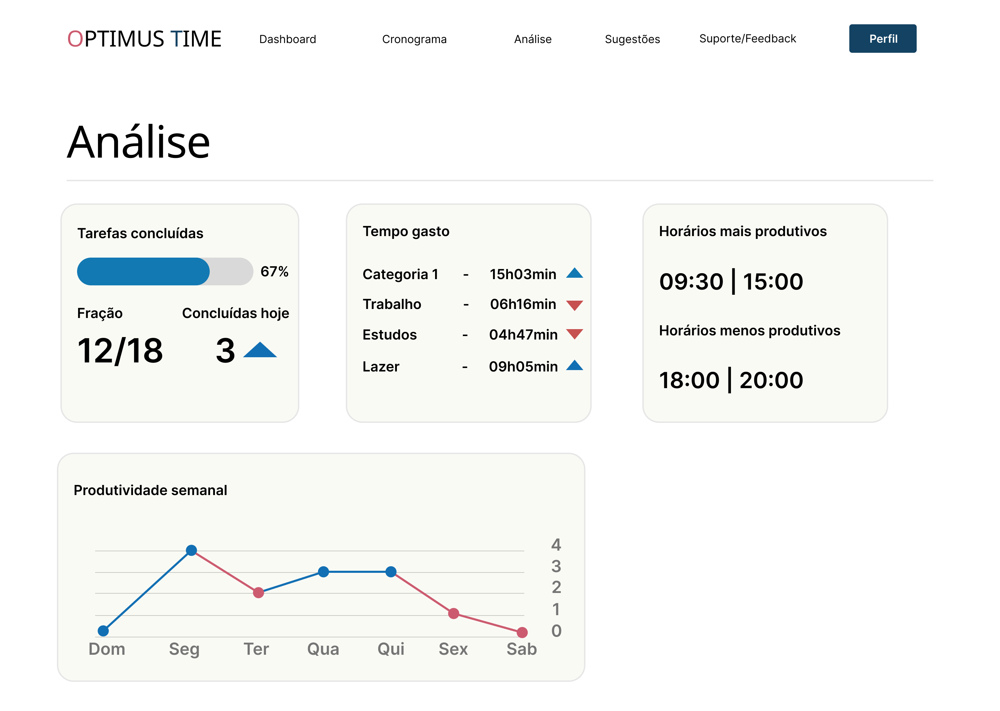
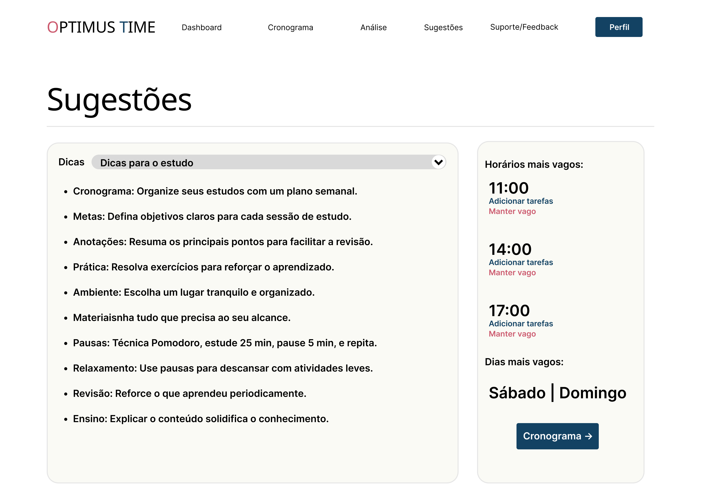
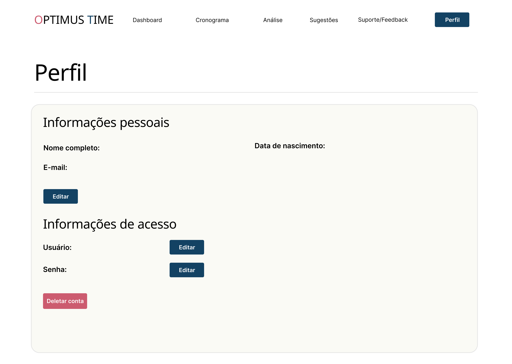
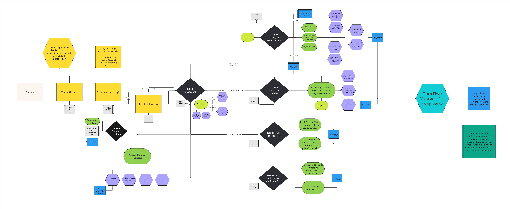
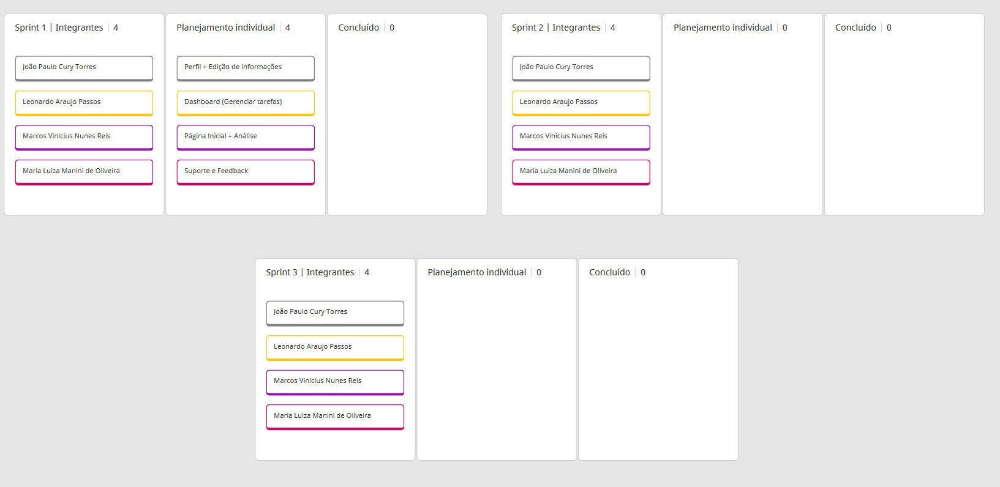

# Introdução

Informações básicas do projeto.

* **Projeto:** Optimus Time
* **Repositório GitHub:** [ti-1-ppl-cc-m-2024-2-g15-dificuldade-em-otimizar-o-tempo-2](https://github.com/ICEI-PUC-Minas-PPLCC-TI/ti-1-ppl-cc-m-2024-2-g15-dificuldade-em-otimizar-o-tempo-2)
* **Membros da equipe:**

  * [João Paulo Cury Torres](https://github.com)
  * [Leonardo Araújo Passos](https://github.com/LeoPassos98)
  * [Marcos Vinícius Nunes Reis](https://github.com/marcosware)
  * [Maria Luíza Manini de Oliveira](https://github.com/malumanini)

A documentação do projeto é estruturada da seguinte forma:

1. Introdução
2. Contexto
3. Product Discovery
4. Product Design
5. Metodologia
6. Solução
7. Referências Bibliográficas

✅ [Documentação de Design Thinking (MIRO)](files/processo-dt-G15.pdf)

# Contexto

Você provavelmente já sentiu que estava afogado de afazeres alguma vez na vida, não é? E com os dispositivos eletrônicos, redes sociais e seus emergentes vídeos curtos, a falta de instruções e uma rotina pesada faz com que você não seja o único sofrendo disso.

Muitas pessoas enfrentam dificuldades para otimizar o tempo devido à sobrecarga de tarefas, falta de planejamento e distrações. E nos últimos tempos, isso vem ficando cada vez mais difícil com o quão fácil os dispositivos eletrônicos estão facilmente em nosso alcance, permitindo que nos distraímos. Isso pode causar atrasos na rotina e uma sensação de improdutividade, sendo essencial o uso de métodos para gerenciar e otimizar o tempo, priorizar atividades e alcançar um equilíbrio entre o trabalho e o lazer.

Sabendo que quase [62% dos jovens não fazem a gestão de seu próprio tempo](https://valor.globo.com/carreira/noticia/2024/09/21/mais-da-metade-dos-jovens-nao-faz-gestao-do-proprio-tempo-diz-pesquisa.ghtml), de acordo com a ONG JA Brasil, o nosso grupo visa criar uma plataforma online voltada para auxiliar os usuários a otimizar seu tempo, conectando-os a ferramentas e estratégias para melhorar sua produtividade a fim de reduzir essa porcentagem.

## Problema

 * Dificuldade em gerenciar o tempo: Muitas pessoas enfrentam desafios para organizar suas tarefas e prioridades, levando a perda de produtividade e acúmulo de responsabilidades.
 * Impacto na qualidade de vida: A falta de estratégias eficazes para otimizar o tempo pode resultar em estresse, esgotamento e uma sensação constante de sobrecarga.
 * Dificuldade de acesso a ferramentas: Usuários podem ter dificuldade em encontrar métodos e recursos confiáveis para melhorar sua gestão do tempo de forma prática e acessível.
 * Sobrecarga de responsabilidades: O excesso de tarefas e a falta de organização resultam em longas listas de coisas a fazer, aumentando o tempo necessário para concluir atividades importantes.

## Objetivos

* Facilitar a otimização do tempo:
Nosso projeto visa criar uma plataforma online que ajuda os usuários a organizar e gerenciar melhor seu tempo, conectando-os a ferramentas e estratégias eficazes de produtividade.

* Reduzir as dificuldades no aproveitamento do tempo:
A plataforma oferecerá uma maneira prática e acessível para os usuários identificarem suas prioridades, planejarem suas atividades e alcançarem um equilíbrio entre trabalho e vida pessoal.

* Promover um estilo de vida mais saudável:
Com uma boa gestão de tempo, se reduz a procrastinação, garantindo uma rotina mais ativa e produtiva. Dessa forma, evita-se o estresse, o esgotamento e mantém o aproveitamento do tempo para hobbies e outros interesses.

## Justificativa

* Impacto positivo na produtividade: Ao facilitar o acesso a ferramentas de gestão de tempo, podemos auxiliar os usuários a aumentar sua eficiência, reduzir o estresse e melhorar sua qualidade de vida.

* Redução da procrastinação: De acordo com o artigo [A Ciência da Procrastinação](https://super.abril.com.br/comportamento/a-ciencia-da-procrastinacao), a procrastinação já é um problemma que afeta 20% dos adultos no Brasil. Com uma otimização de tempo, é possível reduzir a procrastinação e promover um estilo de vida mais produtivo, saudável e menos estressante.

* Proximidade: Além disso, todos os integrantes do grupo conseguem se relacionar com a problemática, tendo em vista que todos são estudantes universitários encarregados de diversas atividades e compromissos.

## Público-Alvo

Embora a dificuldade para a otimizar o tempo possa ser um problema que a maioria das pessoas podem enfrentar, o nosso público-alvo acaba se encaixando pelas faixas etárias de jovem-adulto ou adulto (20-50 anos) e que possuem uma rotina cheia e pesada, especialmente aqueles que frequentam espaços escolares, como estudantes, estagiários, professores, coordenadores e outros profissionais.
Muitos deles, possuem acesso à tecnologia, que pode ser um instrumento de trabalho ou também uma das próprias causas do problema. Levando em consideração as diferenças na rotina e na família.
Descreva quais são as pessoas que usarão a sua aplicação indicando os diferentes perfis. A ideia é, dentro do possível, conhecer um pouco mais sobre o perfil dos usuários: conhecimentos prévios, relação com a tecnologia, relações hierárquicas, etc.

Stakeholders:

* Fundamentais: Profissionais e estudantes que precisam organizar suas rotinas.
* Importantes: Indivíduos que buscam melhorar a produtividade.
* Influenciadores: Empresas, educadores, pesquisadores, além de pais e amigos, que apoiam a gestão do tempo.

Personas:

| André Albuquerque               | Aline Maia                                 | Carlos Mendonça                        |
| ------------------------------- | ------------------------------------------ | -------------------------------------- |
| André, um desenvolvedor de software de 19 anos, está lutando para equilibrar seu trabalho e  estudos com sua paixão por jogos  eletrônicos e eSports. Ele busca uma maneira de organizar melhor seu tempo para poder se dedicar aos jogos sem comprometer sua carreira. | Aline, coordenadora de 43 anos, está sobrecarregada com suas responsabilidades profissionais, o que está causando estresse e afetando sua produtividade e vida pessoal. Ela deseja melhorar sua organização para equilibrar suas tarefas profissionais e tempo para relaxar e aproveitar seus hobbies. | Carlos, um professor de 30 anos, enfrenta dificuldades para encontrar tempo para seu hobby de restaurar carros clássicos devido às crescentes responsabilidades no trabalho. Ele quer gerenciar melhor sua agenda para poder se dedicar mais à restauração dos carros sem prejudicar sua carreira.            |

# Product Discovery

## Etapa de Entendimento

* **Matriz CSD e Mapa de Stakeholders**

* **Entrevistas Qualitativas e Highlights de Pesquisa**
  

## Etapa de Definição

### Personas

 **André Albuquerque**

**Aline Maia**

**Carlos Mendonça**

# Product Design

Nesse momento, vamos transformar os insights e validações obtidos em soluções tangíveis e utilizáveis. Essa fase envolve a definição de uma proposta de valor, detalhando a prioridade de cada ideia e a consequente criação de wireframes, mockups e protótipos de alta fidelidade, que detalham a interface e a experiência do usuário.

## Histórias de Usuários

Com base na análise das personas foram identificadas as seguintes histórias de usuários:

| EU COMO...`PERSONA` | QUERO/PRECISO ...`FUNCIONALIDADE`        | PARA ...`MOTIVO/VALOR`               |
| --------------------- | ------------------------------------------ | -------------------------------------- |
| Estudante e Estagiário   | Gerenciar meu tempo | Equilibrar melhor meus estudos, trabalho e hobbies de jogos eletrônicos.             |
| Entusiasta de Jogos         | Uma plataforma para conectar com outros desenvolvedores      | Acelerar o tempo para o compartilhamento de  ideias e projetos |
| Aspirante a ter um próprio estúdio de jogos        | Acesso a recursos e tutoriais para melhorar a administração do tempo      | Melhorar minhas habilidades e alcançar o sucesso financeiro |
| Professor universitário       | Uma ferramenta para organizar melhor minha agenda      | Ter mais tempo para me dedicar aos hobbies sem prejudicar minha carreira acadêmica. |
| Restaurador de carros clássicos         | Organizar meu tempo enquanto pesquiso fornecedores      | Garantir a originalidade e qualidade das minhas restaurações |
| Amante de veículos antigos         | Oportunidades para melhorar minhas técnicas de administração de tempo      | Contribuir para a execução das minhas tarefas diárias e ter mais tempo para o hobby |
| Coordenadora escolar         | Menos demandas adjacentes      | Realizar minha função principal no tempo de trabalho |
| Trabalhadora e mãe         | Definir limites de tarefas diárias      | Evitar trabalho sendo levado para casa |
| Admiradora de passeios com a família         | Organizar o tempo de forma eficiente      | Produzir no trabalho e aproveitar a vida pessoal junto da família |

## Proposta de Valor

 **André Albuquerque**

**Aline Maia**

**Carlos Mendonça**

## Requisitos

As tabelas que se seguem apresentam os requisitos funcionais e não funcionais que detalham o escopo do projeto.

### Requisitos Funcionais

| ID     | Descrição do Requisito                                   | Prioridade |
| ------ | ---------------------------------------------------------- | ---------- |
| RF-001 | Cadastro e login com e-mail, senha ou redes sociais | ALTA       |
| RF-002 | Gerenciar conclusão, nome, data e prioridade das tarefas | ALTA     |
| RF-003 | Mostrar tarefas no dashboard e cronograma | ALTA     |
| RF-004 | Sugerir otimizações no cronograma com base nas prioridades | ALTA     |
| RF-005 | Gerar relatórios e gráficos sobre tempo gasto e progresso | ALTA     |
| RF-006 | Alterar preferências do usuário, como notificações e tema | MÉDIA     |
| RF-007 | Enviar lembretes com notificações com diferenças de cores a partir da prioridade sobre o início das tarefas | MÉDIA     |
| RF-008 | Exibir o propósito do app e um slogan no topo | BAIXA     |
| RF-009 | Formulário simples de cadastro com validação de campos | ALTA     |
| RF-010 | Dashboard com lista de tarefas, botão de nova tarefa e barra de navegação. | MÉDIA     |
| RF-011 | Formulário para criar nova tarefa com campos de nome, data/hora, prioridade | ALTA     |
| RF-012 | Página do cronograma para visualização e reordenação com tarefas organizadas por tempo | MÉDIA     |
| RF-013 | Página de progresso para exibir gráficos e estatísticas sobre tempo gasto e eficiência | MÉDIA     |
| RF-014 | Página de configurações para ajustar preferências de notificação e integração com calendários | MÉDIA     |
| RF-015 | Design responsivo e otimizado para diferentes dispositivos (desktop, tablet, smartphone) com layout dinâmico via CSS | MÉDIA     |
| RF-016 | Perfil do usuário com suas informações com opção de edição | MÉDIA     |
| RF-017 | Criar um pop-up temporário que aparece quando o usuário tenta excluir uma tarefa. | BAIXA     |
| RF-018 | Página dedicada ao envio de feedback, com um formulário contendo campos de texto para categorizar o feedback | BAIXA     |
| RF-019 | Implementar um campo de busca que permite ao usuário filtrar as tarefas por horário | MÉDIA     |
| RF-020 | Exibir um cronômetro de contagem regressiva para tarefas com prazo de conclusão | BAIXA     |
| RF-021 | Implementar um temporizador que permite ao usuário usar a técnica Pomodoro | BAIXA     |
| RF-022 | Implementar notificações automáticas via browser que aparecem quando uma tarefa está prestes a começar | BAIXA     |
| RF-023 | Permitir que o usuário marque uma tarefa como "recorrente" (diária, semanal, mensal) e que ela seja automaticamente replicada no cronograma | MÉDIA     |
| RF-024 | Ícone para mostrar o email de contato para suporte caso ocorra algum bug | BAIXA     |

### Requisitos não Funcionais

| ID      | Descrição do Requisito                                                              | Prioridade |
| ------- | ----------------------------------------------------------------------------------- | ---------- |
| RNF-001 | O sistema deve ser responsivo para outras interfaces (PC, notebook, móvel)          | ALTA       |
| RNF-002 | Deve ser utilizado as linguagens HTML, CSS e JavaScript                             | ALTA       |
| RNF-003 | Interface limpa e fonte de fácil leitura                                            | MÉDIA      |
| RNF-004 | Troca de dados pelo JSON                                                            | MÉDIA      |
| RNF-005 | Seguir a LGPD enquanto estiver tratando os dados do usuário                         | ALTA      |

## Projeto de Interface

Artefatos relacionados com a interface e a interacão do usuário na proposta de solução.

### Wireframes

Estes são os protótipos de telas do sistema.

**Página Inicial**

Página inicial da plataforma, onde o usuário poderá ler sobre o projeto e acessar a página de acesso à conta.

**Página de Login e Registro**

Página que permite o usuário entrar na sua conta ou se registrar caso não possua uma conta.
Possui um formulário simples para inserir os dados.

**Dashboard**

Página principal após login, que exibe as tarefas a serem concluídas, junto da opção de criar ou deletar tarefas.
Além disso, pode visualizar um calendário com as tarefas e uma breve preview da página de Análise.

**Cronograma**

Página que exibe o cronograma de hora em hora dos dias da semana atual.
Possui uma legenda de cor por nível de prioridade das tarefas e um botão de atalho para a criação de tarefas,
página de sugestões e para inserir o horário em que o usuário dorme.

**Análise**

Exibe diversos gráficos e informações conforme a produtividade e o tempo gasto do usuário com as tarefas.

**Sugestões**

Página com listas de sugestões e dicas para o usuário com a opção de selecionar o tema.
Possui também um quadro de horários e dias mais vagos.

**Perfil**

Página com as informações do perfil do usuário. Permitindo a opção de alterá-las ou deletar a conta.

### User Flow

### Protótipo Interativo

✅ [Optimus Time - Protótipo Interativo (Figma)](https://www.figma.com/proto/1sAB5LkR2KcbURoTHtTuOS/Optimus-Time?node-id=4368-321106&node-type=frame&t=TubGKx3PbLodYBNa-1&scaling=scale-down&content-scaling=fixed&page-id=1669%3A162202&starting-point-node-id=4368%3A321106&show-proto-sidebar=1)

# Metodologia

Detalhes sobre a organização do grupo e o ferramental empregado.

## Ferramentas

Relação de ferramentas empregadas pelo grupo durante o projeto.

| Ambiente                    | Plataforma | Link de acesso                                     |
| --------------------------- | ---------- | -------------------------------------------------- |
| Processo de Design Thinking | Miro       | [PPLCC-M - G5 - Dificuldade em otimizar o tempo](https://miro.com/app/board/uXjVKn9kuFg=/)        |
| Repositório de código       | GitHub     | [ti-1-ppl-cc-m-2024-2-g15-dificuldade-em-otimizar-o-tempo-2](https://github.com/ICEI-PUC-Minas-PPLCC-TI/ti-1-ppl-cc-m-2024-2-g15-dificuldade-em-otimizar-o-tempo-2) |
| Protótipo Interativo        | Figma      | [Optimus Time](https://www.figma.com/proto/1sAB5LkR2KcbURoTHtTuOS/Optimus-Time?node-id=4368-321106&node-type=frame&t=TubGKx3PbLodYBNa-1&scaling=scale-down&content-scaling=fixed&page-id=1669%3A162202&starting-point-node-id=4368%3A321106&show-proto-sidebar=1) |
| Comunicação e reunião       | Discord    | [Discord G15](https://discord.com/) |
| Documentação do projeto       | GitHub | [/docs/README.md](https://github.com/ICEI-PUC-Minas-PPLCC-TI/ti-1-ppl-cc-m-2024-2-g15-dificuldade-em-otimizar-o-tempo-2/blob/master/docs/README.md) |

1) Miro - Utilizado para o Design Thinking, aproveitando do modelo já disponibilizado para nós. Possui uma diversidade de opções e permite a colaboração com a equipe e assim se tornando uma ótima opção

2) GitHub - O repositório Git mais conhecido e utilizado. Ótimo para a colaboração e versionamento dos projetos, podendo acompanhar o progresso e rapidamente encontrar erros.

3) Figma - Plataforma que não só auxilia na montagem do protótipo da interface, também nos traz opções de atribuir interatividade nos elementos da página. Assim, idealizar a função dos botões da página se torna rápido e prático.

4) Discord - Aplicativo de fácil acesso para mensagens de textos e de voz, permitindo que os membros da equipe se conecte para reuniões e a troca de ideias.

## Gerenciamento do Projeto

Divisão de papéis no grupo e apresentação da estrutura da ferramenta de controle de tarefas (Kanban).

# Referências

As referências utilizadas no trabalho foram:

* DE SANTI, Alexandre. A ciência da procrastinação. **Superinteressante**, 19 de out. de 2022. Disponível em:
<https://super.abril.com.br/comportamento/a-ciencia-da-procrastinacao>

* ZAMPOLLI, Rafaela. Mais da metade dos jovens não faz gestão do próprio tempo, diz pesquisa. **Valor Econômico**, São Paulo, 21 de set. de 2024. Disponível em:
<https://valor.globo.com/carreira/noticia/2024/09/21/mais-da-metade-dos-jovens-nao-faz-gestao-do-proprio-tempo-diz-pesquisa.ghtml>
